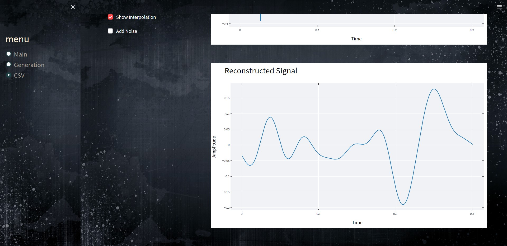

# Sample-Studio

<h2> you can generate your own signal with different summation of amplitudes and frequencies and you can delete specific signals at any time with our drop-down list of added signals </h2>

<h2> you can add noise to your generated signal with  noise checkbox </h2>

<h2> you can sample your generated signal and show the interploation with sample checkbox and interpolation checkbox</h2>

<h2> you can reconstruct your signal after sampling with Whittaker–Shannon interpolation</h2>

<h2> you can upload any signal as csv file<h2>

<h2> after uploading your csv file you can show sampled signal , add show noise and show interploation  </h2>

  <h2>  you can reconstruct your signal after sampling with Whittaker–Shannon interpolation</h2>
  
  
  

